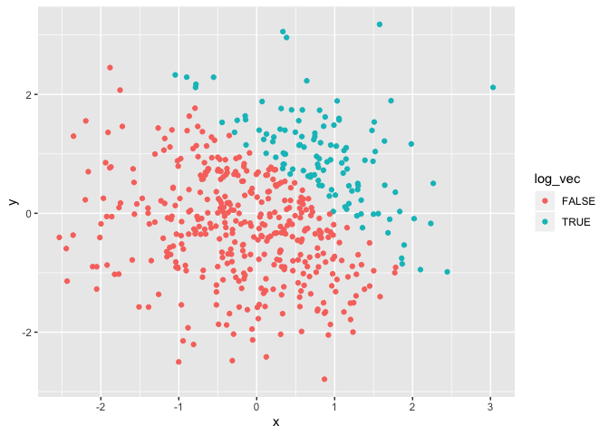
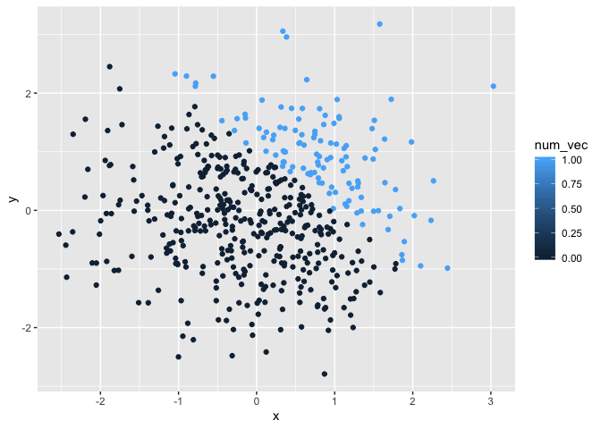
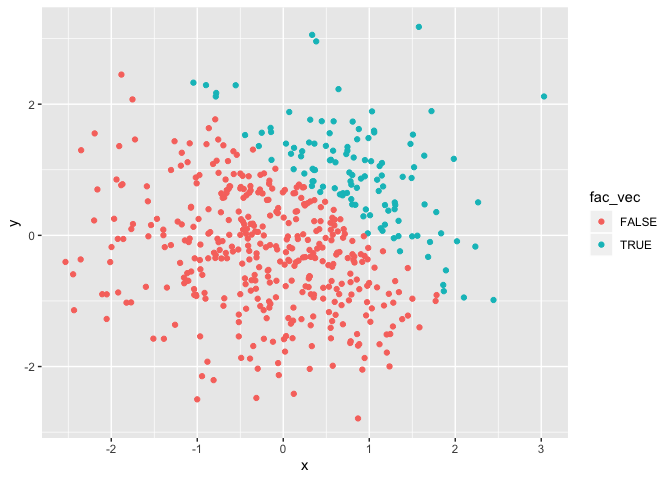

P8105\_HW1\_cm3928
================
Clement Mugenzi
9/14/2019

# Question 1

## First Part

Here, the package Tidyverse was loaded but the code chunk hidden.

``` r
hw_df <- tibble(
  rad_sample = rnorm(8),
  log_vec = rad_sample > 0,
  char_vec = c("1", "2", "3", "4", "5", "6", "7", "8"),
  vec_factor = factor(c("male", "female",
                        "female", "female",
                        "male", "male",
                        "male", "female"))
)

mean_samp = mean(pull(hw_df, rad_sample))
mean_samp
```

    ## [1] -0.7207525

``` r
mean_log = mean(pull(hw_df, log_vec))
mean_char = mean(pull(hw_df, char_vec))
```

    ## Warning in mean.default(pull(hw_df, char_vec)): argument is not numeric or
    ## logical: returning NA

``` r
mean_fac = mean(pull(hw_df, vec_factor))
```

    ## Warning in mean.default(pull(hw_df, vec_factor)): argument is not numeric
    ## or logical: returning NA

A warning message is generated because I am trying to calculate the mean
of character variables and that is not possible. I am going to have to
convert some (if not all) my variables to numeric in order to obtain
their respective mean.

Below I will convert the logical, character, and factor variables to
numeric using the ‘as.numeric’ function.

``` r
as.numeric(pull(hw_df, log_vec))
as.numeric(pull(hw_df, char_vec))
as.numeric(pull(hw_df, vec_factor))
```

## What happens?

  - When as.numeric is applied on the logical variable, I get zeros and
    ones back, which represents FALSE and TRUE respectively. Therefore,
    the as.numeric basically converted characters into numbers. And when
    the mean function is applied on this new logical variable, I get
    0.375 as its mean (this mean is subjected to change every time this
    code is ran since we are dealing with a random sample).

  - Secondly, when as.numeric is applied on the char\_vec, the result is
    eight identical numbers since variables in a dataframe have to be of
    the same lenght. Therefore, since the character variable was inside
    quotes, the as.numeric fucntion produces real numbers (without
    quotes) but this function dows not convert this character variable
    to numeric.

  - Third, when as.numeric is applied on the vec\_factor, the result are
    numbers from one to three which represents the three levels and
    their distribution in the factor variable. Again as.numeric does not
    change this factor variable to numeric.

## Why?

The reason why we could not determine the mean of the last two variables
is because they are neither numeric not are they logical.

Yes, this explain why we could only find the mean of the random sample
and logical variable (as they are numeric and logical) but not the mean
for character and factor variables.

## Second Part

In this section, I will perform three different tasks in the same code
chunk.

**1.** First, I will convert the logical vector to numeric, and multiply
the random sample by the result.

**2.** I will convert the logical vector to a factor, and multiply the
random sample by the result.

**3.** Third, I will convert the logical vector to a factor and then
convert the result to numeric, and multiply the random sample by the
result.

``` r
# (1)
log_as_num <- as.numeric(pull(hw_df, log_vec))
log_as_num
```

    ## [1] 1 0 1 0 0 0 0 0

``` r
x <- log_as_num
y <- rnorm(8)
x * y # Where x is the converted logical variable and y is the random sample.
```

    ## [1] -0.01144108  0.00000000  0.08034788  0.00000000  0.00000000  0.00000000
    ## [7]  0.00000000  0.00000000

``` r
# (2)
log_as_fac <- as.factor(log_as_num)
t <- log_as_fac
t * y
```

    ## Warning in Ops.factor(t, y): '*' not meaningful for factors

    ## [1] NA NA NA NA NA NA NA NA

``` r
# (3)
log_to_num <- as.numeric(log_as_fac)
d <- log_to_num
d * y # where d is the converted logical factor and y is the random sample.
```

    ## [1] -0.02288215 -0.91885638  0.16069575  0.24795577  0.63812909  0.74767840
    ## [7] -1.40446691  0.97926064

# Question 2

## Creating a Dataframe

Below I am going to create a dataframe comprised of:

**1.** Two random samples (x and y) from a standard normal distribution.
Size is 500.

**2.** A logical vector indicating whether x + y \> 1.

**3.** Created a numeric vector by coercing (‘as.numeric’) the logical
vector.

**4.** Created a factor vector by coercing (‘as.factor’) the logical
vector.

``` r
rad_df <- tibble(
  x = rnorm(500),
  y = rnorm(500),
  log_vec = x + y > 1,
  num_vec = as.numeric(log_vec),
  fac_vec = as.factor(log_vec)
)
num.cols <- ncol(rad_df)
num.rows <- nrow(rad_df)
mean_samp <- mean(x)
median_samp <- median(x)
sd_samp <- sd(x)
logvec_prop <- length(which(pull(rad_df, log_vec))) / 
  (length(pull(rad_df, log_vec)))
```

The number of columns and rows in my dataset are **5** and **500**
respectively.

The mean, median and standard deviation of the random variable **x** are
given below **0.25**, **0**, and **0.46** respectively. Furthermore, the
proportion of cases for which x + y \> 1 is **0.23.**

## Building Scatterplots using ggplot2

### First Scatterplot

``` r
log_ggplot <- ggplot(data = rad_df) + 
  geom_point(aes(x = x, y = y, color = log_vec))
log_ggplot
```

<!-- -->

### Second Scatterplot

``` r
num_ggplot <- ggplot(data = rad_df) + 
  geom_point(aes(x = x, y = y, color = num_vec))
num_ggplot
```

<!-- -->

### Third Scatterplot

``` r
fac_ggplot <- ggplot(data = rad_df) + 
  geom_point(aes(x = x, y = y, color = fac_vec))
fac_ggplot
```

<!-- -->

**Comment:** The factor and logical vectors produces similar
scatterplots because they can only have two possible values (TRUE and
FALSE). Whereas the numeric vector can possess multiple values between
zero and one, which is why a gradient scatterplot was produced.

### Exporting First Scatterplot

``` r
ggsave("First_scatterplot.pdf", plot = log_ggplot,
       path = "HwQ1_2_files/Scatterplot/")
```

    ## Saving 7 x 5 in image
